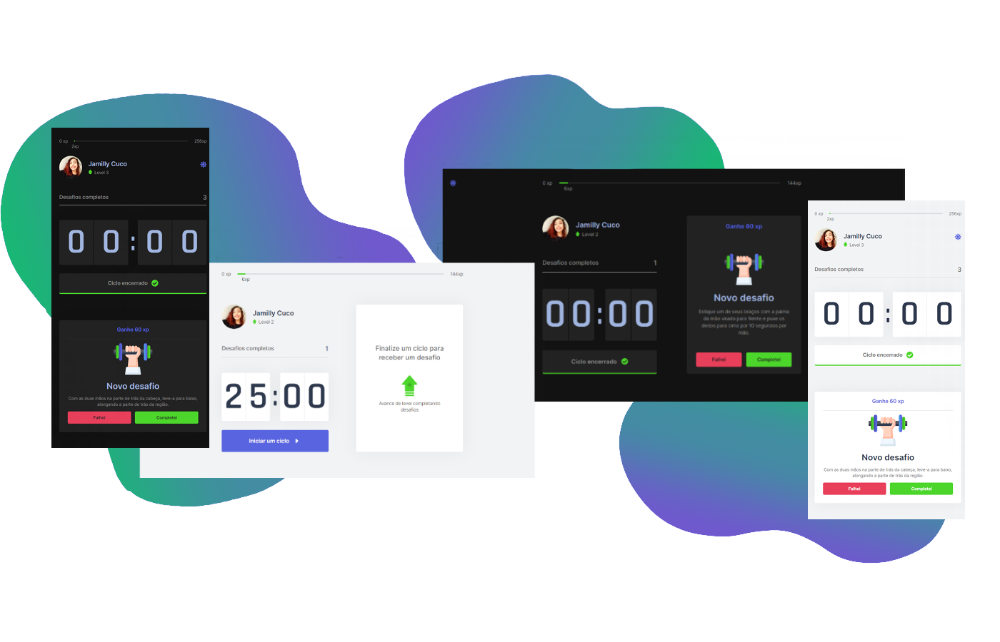

<p align="center">
  
</p>

<p align="center">
  <a href="#-tecnologias">Tecnologias</a>&nbsp;&nbsp;&nbsp;&nbsp;|&nbsp;&nbsp;&nbsp;&nbsp;
  <a href="#-projeto">Projeto</a>&nbsp;&nbsp;&nbsp;&nbsp;|&nbsp;&nbsp;&nbsp;&nbsp;
  <a href="#-como-rodar">Como rodar</a>&nbsp;&nbsp;&nbsp;&nbsp;
</p>

<p align="center">
  
</p>

## 💻 Tecnologias

As tecnologias utilizadas foram:

- React
- Next.js
- TypeScript

## 🚀 Projeto

O move it foi um projeto construído na trilha de ReactJs da quarta edição da NLW(Next Level Week), evento da Rocketseat.
O projeto surgiu como uma forma de implementar o método de Pomodoro, para aqueles usuários que passam muito tempo na frente do computador.
A cada ciclo de 25 minutos, a aplicação exibe uma notificação para que o usuário realize um exercício e ganhe xps para subir de nível.

## ⚙ Como rodar

### 💻 Pelo site
Acesse o link: [Move.it](https://moveit-omega-ruddy.vercel.app)

### ⚙ Localmente
Clone o repositório com o comando:
``` bash
git clone https://github.com/alt-jams/nlw-04.git
```
Entre no projeto e instale as dependencias com o comando:
``` bash
yarn
```
Inicie o projeto:
``` bash
yarn dev
```


<p align="center">
    💜
</p>
